R you ready to ggplot2?
========================================================
author: Basic Plots
transition: rotate
transition-speed: slow
width: 1440
height: 900
incremental: true
date: October 10, 2014
css: ../theme/my_style.css

<small> Tony Fujs </small>


Rstudio
====================================

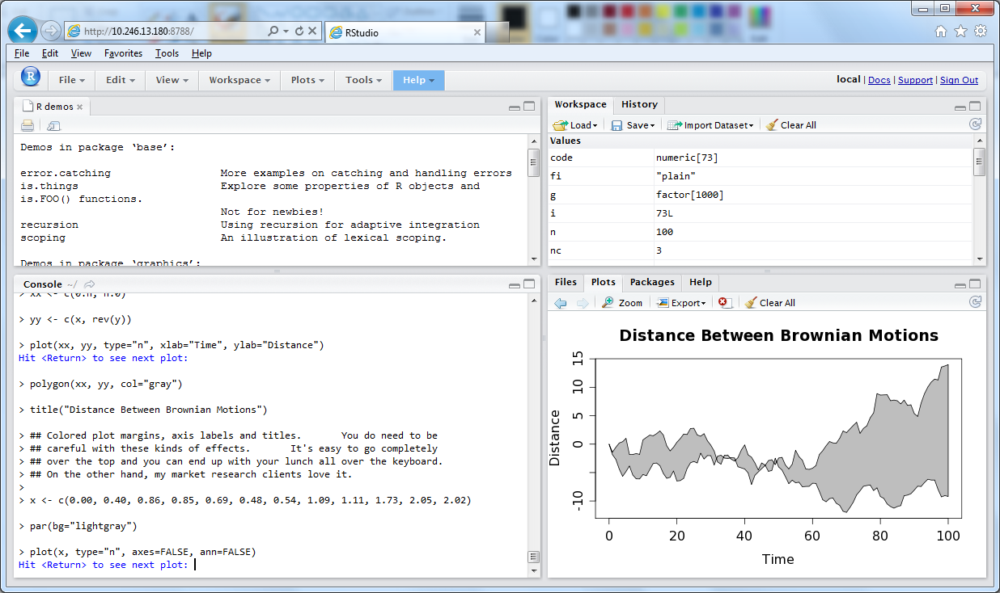


LET'S PLAY WITH CODE!!
====================================
incremental: true

* Open the 02_basic_plots.R file
* Edit ONLY the XXXX

Data set
====================================
incremental: false


```
 state stores population
    AL     89    4545049
    AR     81    2776221
    AZ     57    5974834
    CA    157   35795255
    CO     56    4660780
```

Scatter plot
====================================
left: 55%

<pre><code class="r">
# population vs stores
ggplot(
<b>aes(x = XXXX, 
    y = XXXX)</b>,
data = summary2005) +
geom_point() 
</code></pre>

***

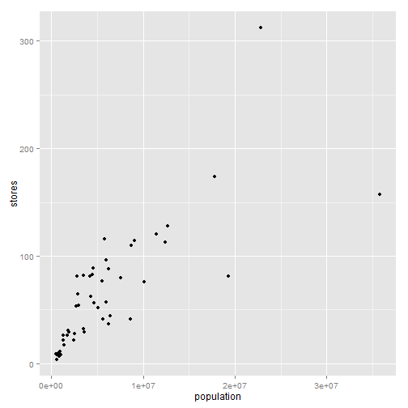


Scatter plot
====================================
left: 55%
incremental: false

<pre><code class="r">
# population vs stores
ggplot(
<b>aes(x = population, 
    y = stores)</b>,
data = summary2005) +
geom_point() 
</code></pre>

***


Scatter plot + regression line
====================================
left: 55%

<pre><code class="r">
# Complete code to add a regression line
ggplot(
aes(x = population,
    y = stores),
data = summary2005) +
geom_point() +
<b>geom_XXXX</b>
</code></pre>

***


Scatter plot + regression line
====================================
left: 55%
incremental: false

<pre><code class="r">
# Complete code to add a regression line
# Hint use the cheat sheet
ggplot(
aes(x = population,
    y = stores),
data = summary2005) +
geom_point() +
<b>geom_smooth()</b>
</code></pre>

***

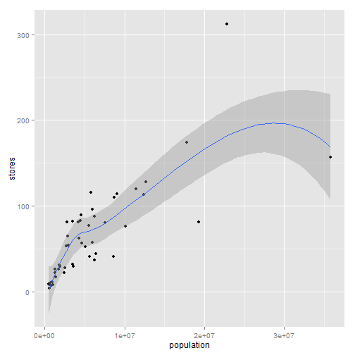


Layered plots
====================================
incremental: false
left: 60%

New plots elements are added using the plus sign

<pre><code class="r">
ggplot(...) <b>+</b>
geom_point() <b>+</b>
geom_smooth() <b>+</b>
scale_y_continuous() <b>+</b>
coord_polar()
</code></pre>

***


Bubble chart
====================================
left: 55%

<pre><code class="r">
# Bubbles represent market_share 
ggplot(
  aes(x = population, 
      y = stores,
      <b>XXXX = market_share</b>),
  data = summary2005) +
  geom_point()
</code></pre>

***

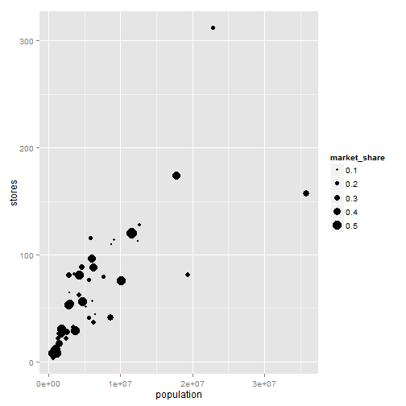


Bubble chart
====================================
left: 55%
incremental: false

<pre><code class="r">
# Bubbles represent market_share
ggplot(
  aes(x = population, 
      y = stores,
      <b>size = market_share</b>),
  data = summary2005) +
  geom_point()
</code></pre>

***


Bar chart - Unordered
====================================
left: 55%

<pre><code class="r">
ggplot(
  aes(x = state,
      y = population),
  data = summary2005) +
  <b>geom_bar(stat = 'identity'</b>)
</code></pre>

***

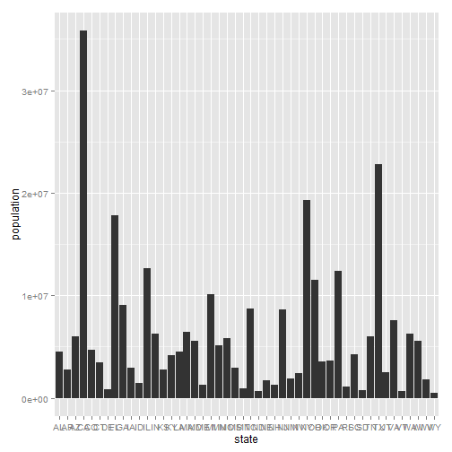


Bar chart - ordered
====================================
left: 55%

<pre><code class="r">
ggplot(
  aes(x = <b>reorder(state, population)</b>,
      y = population),
  data = summary2005) +
  geom_bar(stat = 'identity')
</code></pre>

***

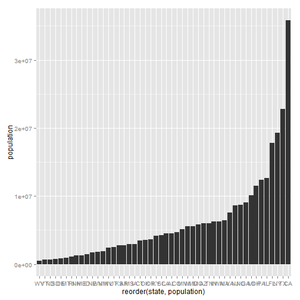


Bar chart - ordered & flipped
====================================
left: 55%

<pre><code class="r">
# Update code to flip this bar chart (States will show vertically)
ggplot(
  aes(x = reorder(state, population),
      y = population),
  data = summary2005) +
  geom_bar(stat = 'identity') +
  <b>coord_XXXX</b>
</code></pre>

***

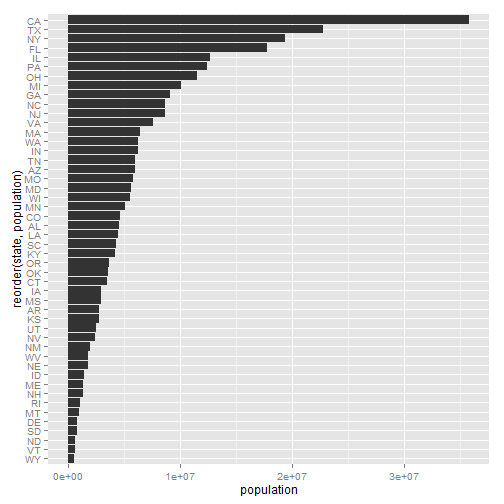


Bar chart - ordered & flipped
====================================
left: 55%
incremental: false

<pre><code class="r">
# Update code to flip this bar chart (States will show vertically)
ggplot(
  aes(x = reorder(state, population),
      y = population),
  data = summary2005) +
  geom_bar(stat = 'identity') +
  <b>coord_flip()</b>
</code></pre>

***


TAKE A GUESS!!
====================================
type: practice
left: 65%
incremental: false

<pre><code class="r">
# WHY CAN'T WE JUST SWITCH AESTHETICS??
ggplot(
  <b>aes(x = population),
      y = reorder(state, population))</b>,
  data = summary2005) +
  geom_bar(stat = 'identity')
</code></pre>

***


DATASET
====================================
incremental: false


```
 year state stores population
 1995    AL     76    4296800
 1995    AR     73    2535399
 1995    AZ     31    4432499
 1995    CA     87   31696582
 1995    CO     36    3826653
```

```
 year state stores population
 2005    VA     80    7563887
 2005    VT      4     618814
 2005    WA     37    6261282
 2005    WI     77    5541443
 2005    WV     31    1803920
 2005    WY      9     506242
```

Bar chart - continued
====================================
left: 55%

<pre><code class="r">
# Update the code so each bar represents the total population of the US for each year
ggplot(
aes(x = factor(year),
    y = population),
data = summary95_05) +
geom_bar(stat = 'identity',
         position = 'identity')
</code></pre>

***


Bar chart - continued
====================================
left: 55%
incremental: false

<pre><code class="r">
ggplot(
aes(x = factor(year),
    y = population),
data = summary95_05) +
geom_bar(stat = 'identity',
         <b>position = 'stack'</b>)
</code></pre>

***

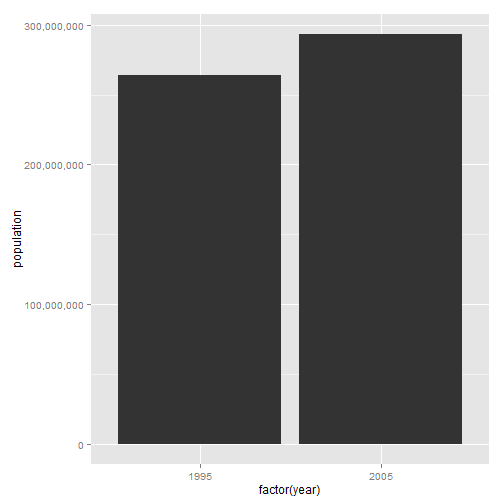


DATASET
====================================
incremental: false


```
 year state stores population
 1965    AR      3    1894000
 1970    AR      8    1930077
 1970    KS      1    2247823
 1970    LA      1    3650209
 1970    MO      7    4684768
```

```
 year state stores population
 2005    VA     80    7563887
 2005    VT      4     618814
 2005    WA     37    6261282
 2005    WI     77    5541443
 2005    WV     31    1803920
 2005    WY      9     506242
```

Line chart - Iteration 1
====================================
left: 55%
incremental: false

### Objective:
Visualize increase of stores over time, by state

<pre><code class="r">
# Not what we are expecting...
ggplot(
  aes(x = year,
      y = stores),
  data = summary) +
  geom_line()
</code></pre>

***

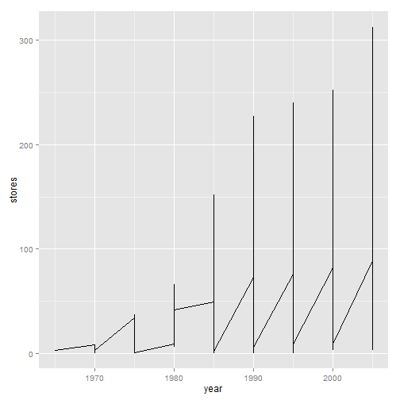


Line chart - Iteration 1
====================================
left: 55%
incremental: false

<pre><code class="r">
# Fix the code below to produce this plot
ggplot(
  aes(x = year,
      y = stores),
  data = summary) +
  geom_line()
</code></pre>

***

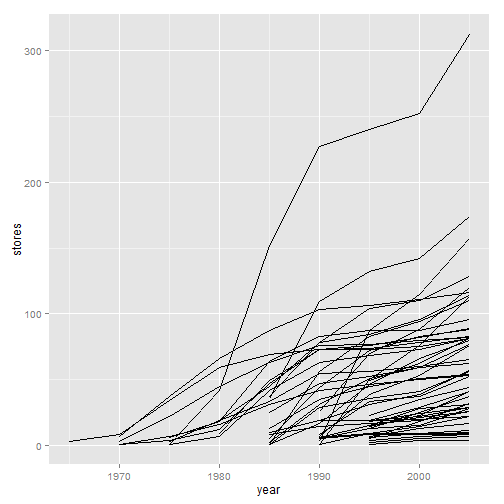

Line chart - Iteration 1
====================================
left: 55%
incremental: false

<pre><code class="r">
# Fix the code below to produce this plot
ggplot(
  aes(x = year,
      y = stores,
      <b>group = state</b>),
  data = summary) +
  geom_line()
</code></pre>

***


Line chart - Iteration 2
====================================
left: 55%
incremental: false

<pre><code class="r">
# Edit code to change lines color depending on state
ggplot(
  aes(x = year,
      y = stores,
      group = state),
  data = summary) +
  geom_line()
</code></pre>

***

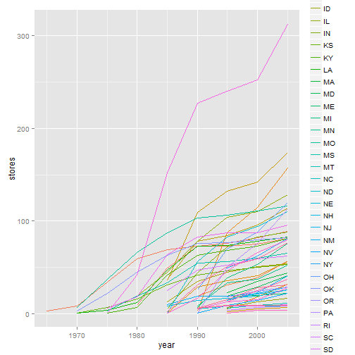


Line chart - Iteration 2
====================================
left: 55%
incremental: false

<pre><code class="r">
# Edit code to change lines color depending on state
ggplot(
  aes(x = year,
      y = stores,
      group = state,
      <b>color = state</b>),
  data = summary) +
  geom_line()
</code></pre>

***


Line chart - Iteration 3
====================================
left: 55%

<pre><code class="r">
# Edit the code to produce the following small multiple
ggplot(
  aes(x = year,
      y = stores,
      group = state,
      color = state),
  data = summary) +
  geom_line()
</code></pre>

***


Line chart - Iteration 4
====================================
left: 55%
incremental: false

<pre><code class="r">
# Edit the code to produce the following small multiple
ggplot(
  aes(x = year,
      y = stores,
      group = state,
      color = state),
  data = summary) +
  geom_line() +
  <b>facet_wrap(~state)</b>
</code></pre>

***

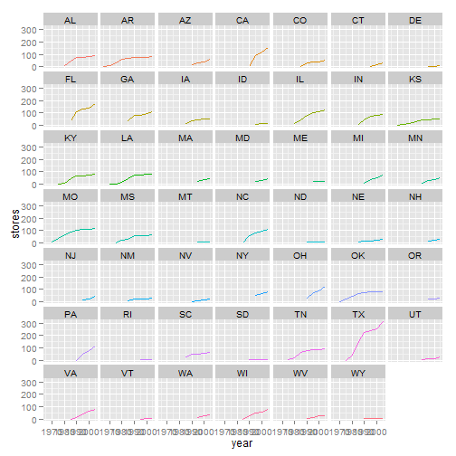


